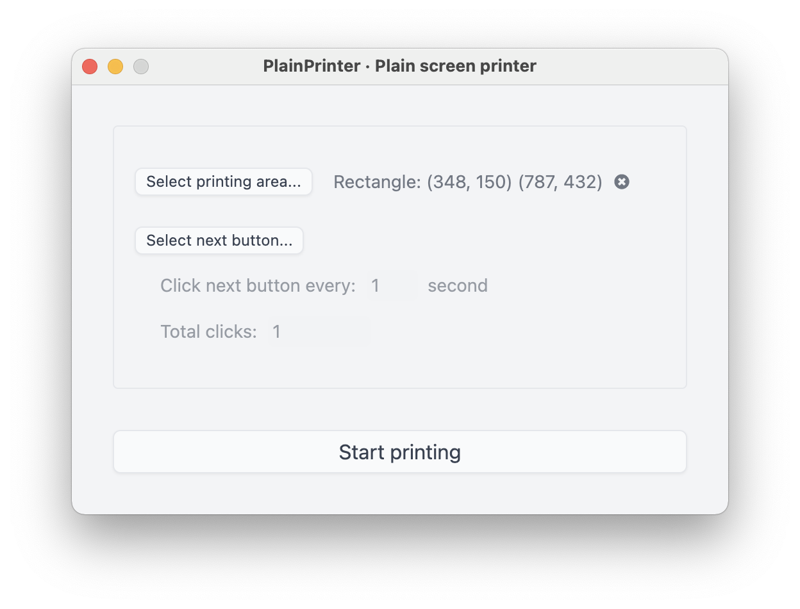

# PlainPrinter

> Take multiple screenshots and convert them into a PDF file

## Features

- Choose an area to take screenshots
- Convert screenshots into a PDF
- Auto click on the Next button

## Download

- For macOS: https://github.com/plainlab/plainprinter/releases
- For Windows: I don't have a Windows device so you have to build it yourself.

---

&copy; 2021 PlainLab
