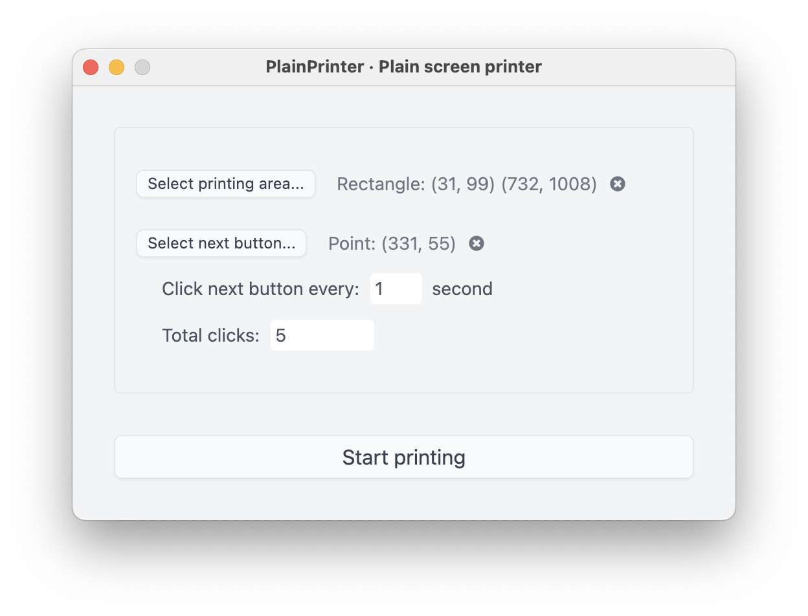

# PlainPrinter

> Take multiple screenshots and convert them into a PDF file

## Features

- Choose an area to take screenshots
- Convert screenshots into a PDF
- Auto click on the Next button

## Installation

For macOS & Windows: https://github.com/plainlab/plainprinter/releases

- macOS: Get `.dmg` file, open it and drag the app into Applications folder, for M1 mac: get `arm64.dmg` file instead.
- Windows: Get `.exe` file and open it to install.

## CLI version

https://github.com/manhtai/vitalsource-printer

## Buy me a coffee

[PayPal](https://paypal.me/vomanhtai)

---

&copy; 2022 PlainLab
